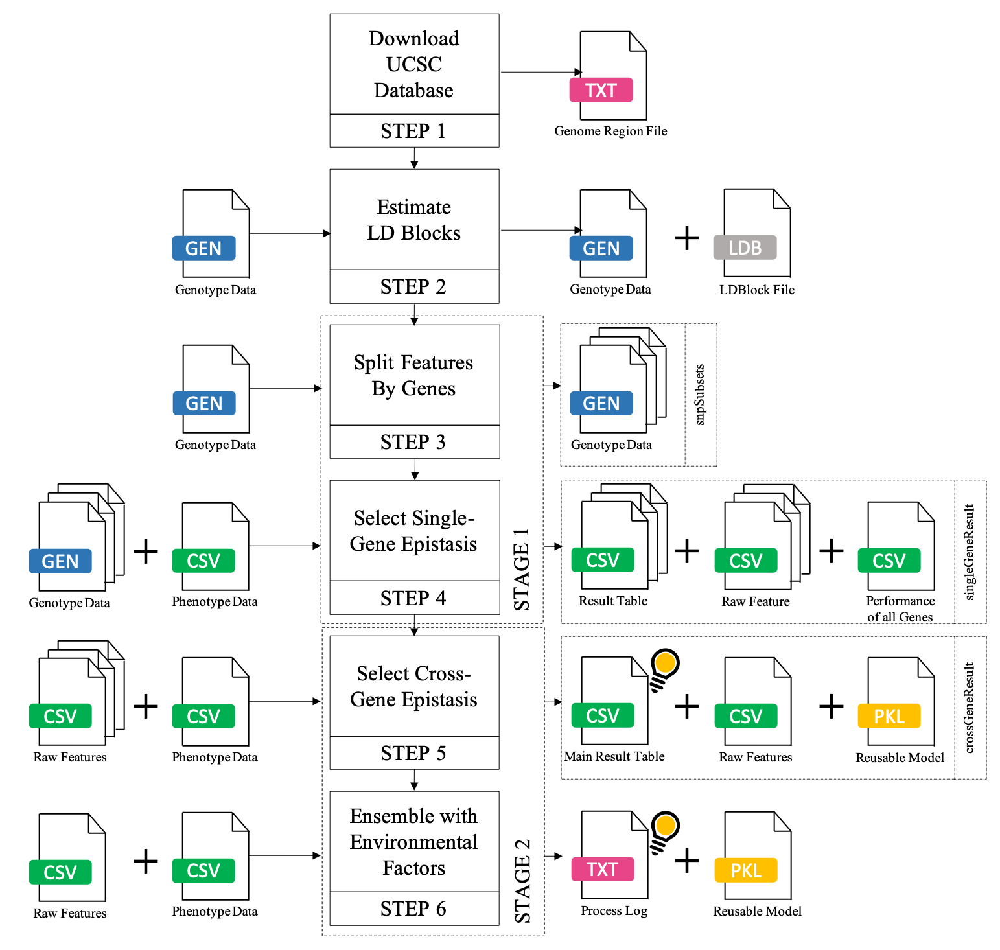

.. workflow:

How it Works
============

The main procedures of GenEpi described in `Introduction <index\.html#Introduction>`_. In addition to the main procedures, two pre-processing steps are also implemented in GenEpi: retrieving the gene information from public databases and reducing the gene information from public databases and reducing the dimensionality of the features using linkage disequilibrium. All of the precedures be implemented as six steps in GenEpi submoudles. The interations bewteen the I/O and these submodules please find in the figure below. For API documentations of these submodules please find in next `section <api\.html>`_. 

   The interations bewteen the I/O and GenEpi submodules.

